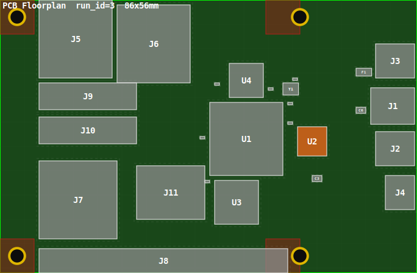
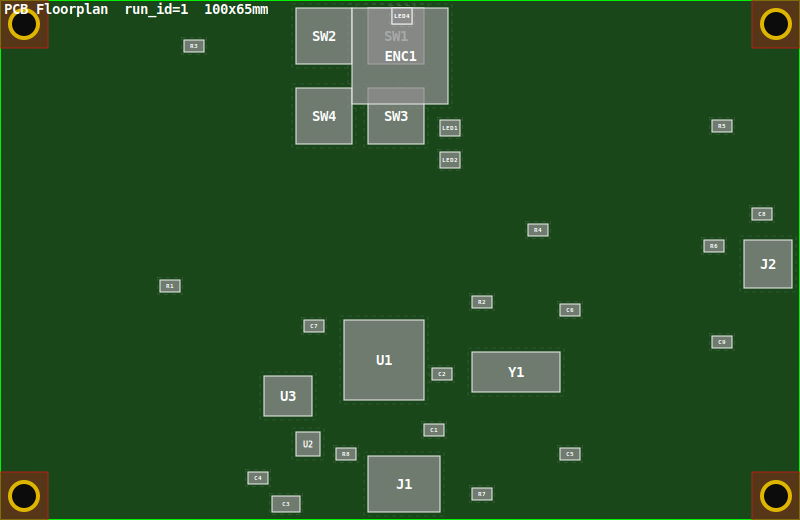
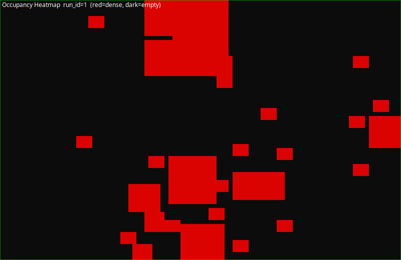

# PCB Floorplanner

> 🤖 **AI-powered PCB layout** — from plain English to a placed, optimised floorplan in minutes.



> ⚡ *Full Raspberry Pi 4 Model B layout — 26 components, 85.6×56 mm, zero hard violations.  
> Generated entirely from a single natural-language prompt. No schematic tools. No layout expertise required.* 🚀

**Describe your hardware in plain English. Get a placed, optimised PCB floorplan.**

No schematic tools. No layout expertise required. Just tell the AI what you're building.

```text
"Create a floorplan for an 8-bit retro MIDI looper with USB-MIDI in,
 3.5mm AUX out, and control buttons — fits an Intel NUC-like case."
```

The pipeline reasons about ICs, places 40 components, runs simulated annealing,
scores violations, and renders a PNG — all in one session.

---

## How it works

An LLM-guided 12-step pipeline alternates between AI reasoning and deterministic Python.
All state lives in a single SQLite database (`db/floorplan.db`).
No data is passed between steps as arguments — the DB is the contract.

| Step | Name | Engine |
|---|---|---|
| 0 | User prompt intake | LLM |
| 0.25 | **Mechanical architecture** — enclosure type, face mapping, MECH-N rules | LLM |
| 0.5 | Hardware architecture — functional blocks, IC selection, ADRs | LLM |
| 1 | BOM + netlist — components, packages, nets, requirements | LLM |
| 2 | Board definition — outline, keep-outs, mount holes | LLM + Python |
| 3 | Component geometry — footprint sizes, courtyard margins | LLM + Python |
| 4 | Constraint derivation — NEAR/FAR/FIXED/ALIGN rules | LLM |
| 5 | Design lock — version frozen, SHA-256 hash stored | Python |
| 6 | Initial placement — FIXED first, NEAR clusters, greedy fill | Python |
| 7 | Simulated annealing — minimises penalty across 5k–30k iterations | Python |
| 8 | Scoring + violation report — hard and soft violations flagged | Python |
| 9 | Render — PNG floorplan, occupancy heatmap, HTML report | Python |
| 9.5 | Visual inspection — adversarial checklist against rendered PNG | LLM |
| 10 | LLM review + decision — APPROVE / MODIFY / RERUN | LLM |

**Step 0.25 runs before any IC is selected.** It establishes the physical reality of the
enclosure — which PCB edges face which surfaces, what must be reachable from outside, where
standoffs and height-limited zones are — and writes a numbered set of hard mechanical rules
(MECH-N) that every downstream step treats as non-negotiable. This is the step most often
skipped in hobby builds, and its absence is the single most common cause of boards where
connectors are inaccessible from outside the box.

LLM steps at 0.25, 0.5, 1, 2, 3, and 4 include mandatory evidence-based web research and
fact-checking for all major unknowns (IC packages, board dimensions, clearance rules).
The agent decides how to research — facts are never made up.

---

## Output

| File | Description |
|---|---|
| `output/floorplan.png` | PCB-green raster render — components, keep-outs, mount holes, labels |
| `output/heatmap.png` | Occupancy density heatmap — highlights congested zones |
| `output/report.html` | Full BOM table, constraint list, violation report, convergence plot |

---

## Quick start

Load the skill in your OpenCode session and describe your hardware:

```text
"Create a floorplan for an 8-bit retro MIDI looper with USB-MIDI in,
 3.5mm AUX out, and control buttons — fits an Intel NUC-like case."
```

That's it. The skill handles everything from IC selection to rendered PNG.

---

## Make targets

| Target | Description |
|---|---|
| `make db-init` | Wipe and reinitialise `db/floorplan.db` (prompts before overwriting) |
| `make db-init FORCE=1` | Wipe and reinitialise without prompting |
| `make db-verify` | Run 17 schema integrity tests against live DB |
| `make db-status` | Show all design versions and optimisation runs |
| `make db-summary` | Component count, violations, and latest score |
| `make lint` | ruff over `db/`, `scripts/`, `tests/` |
| `make test` | Run all 86 tests (unit + integration) |
| `make qa` | format + lint + test |

---

## Key design rules

- **Immutability:** once a `design_version` is LOCKED, components and constraints cannot
  be added. Any post-lock change requires a new `design_versions` row.
- **FIXED connectors:** always set `hard=1` on FIXED edge-connector constraints. The scorer
  applies an extra `500 × delta_mm` penalty for hard FIXED violations, strongly incentivising
  SA to keep connectors at the board edge.
- **Mount hole keep-outs:** set `"is_mount_clearance": true` on corner keep-outs that
  intentionally surround a mount hole. This disables the annular-ring overlap check for
  that zone. The annular ring formula is `diameter_mm / 2 + 0.5 mm`.
- **SA reruns:** use `optimizer_annealing.py --overwrite` when re-running SA on an existing
  `run_id`. Without it the script aborts on a UNIQUE constraint in `score_history`.
- **Keep-out anti-pattern:** never define a keep-out that spans a full board edge — it blocks
  FIXED edge connectors. Use corner-only keep-outs for mount holes.

---

## Constraint types

| Type | Meaning | Key parameters |
|---|---|---|
| `NEAR` | Two components must be within `max_dist_mm` | `max_dist_mm`, `weight`, `hard` |
| `FAR` | Two components must be at least `min_dist_mm` apart | `min_dist_mm`, `weight`, `hard` |
| `FIXED` | Component must be at a board edge (connector, button) | `weight ≥ 10`, `hard=1` |
| `ALIGN` | Two components share a centroid axis | `weight` |

---

## Scoring

The penalty function used by simulated annealing:

```text
total_penalty = constraint_penalty + overlap_penalty + net_length_est + keep_out_penalty
```

- `constraint_penalty` — sum of weighted distance violations for NEAR/FAR/FIXED
- `overlap_penalty` — 100 × overlap area (mm²) per component pair (including courtyard)
- `net_length_est` — half-perimeter bounding box (HPWL) across all nets
- `keep_out_penalty` — 500 × overlap area (mm²) per component in a keep-out zone
- Hard FIXED violations add an extra `500 × delta_mm` on top of the soft penalty

---

## Tests

86 tests across unit and integration suites:

```text
tests/unit/
  test_schema.py          17 DB integrity tests (FK, UNIQUE, CHECK, immutability triggers)
  test_scorer.py          29 scorer unit tests (keep-out, overlap, NEAR/FAR/ALIGN/FIXED, HPWL,
                             hard flag propagation, hard=1 FIXED penalty amplification)
  test_placer.py          13 placer unit tests (cells_for, fits, snap, place_at)
  test_db_write_board.py   9 input validation tests (keep-out bounds, mount hole annular ring,
                             is_mount_clearance flag, full-edge keep-out warning)
  test_db_patch_board.py   4 trigger-bypass safety tests

tests/integration/
  test_placer_integration.py   4 tests — boundary, keep-out, overlap invariant, large component
  test_sa_optimizer.py         3 tests — improvement, keep-out elimination, no off-board placements
```

```bash
make test
# 86 passed
```

---

## Skill

The pipeline is packaged as an [OpenCode](https://opencode.ai) skill:

```text
.opencode/skills/pcb-floorplanner/
├── SKILL.md              Entrypoint — wire-format schemas, step guidance, pitfall warnings
├── references/
│   ├── workflow.md       Full step-by-step reference (EE terminology)
│   └── schema.md         All DB tables, columns, integrity guarantees
└── scripts/              All pipeline scripts (db_write_*, placer, optimizer, renderer)
```

Load the skill in your OpenCode session and say: *"Create a floorplan for…"*

---

## Example output — 8-bit Retro MIDI Looper

> *"Create a floorplan of a 8-bit retro MIDI looper with USB-MIDI in and aux out and some
> control buttons which fits into a Rommée card box like case."*

**Board:** 100×65mm, 2-layer, fits a Rommée card box (~105×70mm internal)

| Placement | Components |
|---|---|
| Bottom edge | J1 — USB-C (MIDI in + 5V power) |
| Right edge | J2 — 3.5mm stereo TRS audio out |
| Top edge | SW1–SW4 buttons, ENC1 rotary encoder, LED1–LED4 status LEDs |
| Centre | U1 ATmega32U4 MCU, U3 EEPROM, Y1 crystal, passives |

**Floorplan:**



**Occupancy heatmap:**



**Stats:** 32 components · 11 nets · 31 constraints · 100k SA iterations · 0 hard violations

**Key design choices (DIY mindset):**

- ATmega32U4 — native USB MIDI device mode, no USB bridge chip needed
- PWM audio via OC1A/OC1B + 1k/100nF RC low-pass filter — no DAC required
- AT24C256 EEPROM via I2C — 32KB for non-volatile MIDI loop storage
- MCP1700 LDO — clean 3.3V analog rail from USB 5V
